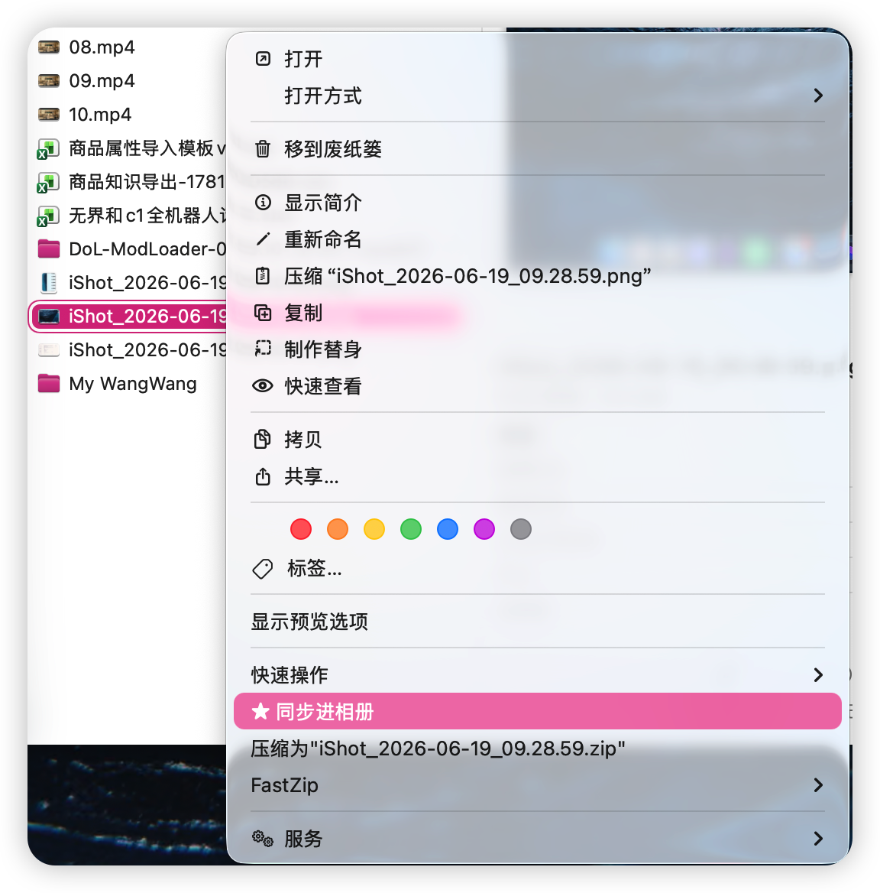

# Import To Photos

一个纯本地 macOS 小工具，用来把指定文件夹里的图片导入系统 **Photos Library**。它会在成功导入的原图文件上写入本地标记，下一次运行时自动跳过已导入过的照片，从而避免重复导入，同时保留原文件在原目录中。

## 普通用户安装

如果只是安装使用，请到 GitHub Release 下载 `ImportToPhotos-v...zip`。不要点 GitHub 页面里的 **Code > Download ZIP**，那个下载的是源码包，不是可直接安装的发行包。

Release zip 解压后：

1. 右键点击 `Install.command`，选择“打开”。
2. 按 macOS 提示确认打开。
3. 第一次同步图片时，允许 Photos 权限。
4. Finder 右键未同步图片，优先找 `★ 同步进相册`；如果顶层菜单没出现，就在“快速操作”或“服务”里找同名入口。

如果安装后不确定哪里出问题，双击 `Doctor.command` 查看诊断；不想继续使用时双击 `Uninstall.command`。

当前免费发行包使用 adhoc 签名，没有 Apple Developer ID 公证。macOS 第一次打开会有安全确认，这是免年费分发无法完全消除的限制。

## 核心特性

- **纯本地代码运行**：使用 Swift、AppKit 和 Photos.framework，不依赖智能体、不联网、不上传到第三方服务。
- **导入到系统照片库**：调用 macOS Photos API，把图片加入当前用户的 Photos library。
- **避免重复导入**：成功导入后写入扩展属性 `local.import-to-photos.uploaded`，下次运行自动跳过。
- **保留原文件**：不会移动、删除或重命名原图片，只添加 Finder 默认不可见的本地标记。
- **Finder 右键同步**：在用户目录内未同步图片的右键菜单中显示“同步进相册”，点击后先备份到上传文件夹，再导入 Photos。
- **后台运行**：app 是 `LSUIElement` 后台应用，不会出现在程序坞；右键同步完成后只显示 3 秒中文短提示。
- **支持 dry-run**：可以先查看哪些图片会导入、哪些图片会跳过。
- **可定制默认导入目录**：通过 `DefaultImportFolder.txt` 固定一个默认文件夹，也可以拖拽文件夹到 app 或从命令行传入路径。
- **带桌面快捷方式脚本**：可以创建 macOS Finder alias 并贴自定义图标。

## 支持的图片类型

当前扫描以下扩展名：

```text
jpg, jpeg, png, heic, heif, gif, tif, tiff, bmp, webp,
avif, hif, heics, heifs, jp2, j2k, jpf, jpx,
dng, cr2, cr3, nef, arw, raf, rw2, orf,
srw, pef, dcr, kdc, mrw, nrw, rwl, 3fr, erf, mef,
mos, x3f, srf, sr2, raw
```

扫描会跳过隐藏文件、`.app` bundle、`.photoslibrary`、`.iconset` 以及工具自身目录，避免把构建产物或图标素材导入照片库。

## 工作原理

1. 程序递归扫描输入文件夹中的受支持图片。
2. 对每张图片检查扩展属性：

   ```text
   local.import-to-photos.uploaded
   ```

3. 没有标记的图片会被导入 Photos。
4. Photos 返回导入成功后，程序才会在原图文件上写入标记。
5. 导入失败的图片不会被标记，下一次运行仍会再次尝试。
6. 如果图片导入成功但写入标记失败，程序会在完成弹窗里列出“已导入但未标记”的文件，提醒后续可能重复导入。

标记值是一个小型 JSON，例如：

```json
{
  "version": 1,
  "importedAt": "2026-05-15T12:34:56Z",
  "appIdentifier": "local.import-to-photos"
}
```

重复判断只看标记是否存在，不会计算文件哈希，也不会查询 Photos library。

## 系统要求

普通用户：

- macOS 12 或更新版本
- 当前用户允许该 app 添加项目到 Photos
- 下载的 Release zip 架构与当前 Mac 匹配；推荐发布 `universal` 包

开发和打包：

- macOS 12 或更新版本
- Apple Swift 编译器

查看 Swift 版本：

```sh
swiftc --version
```

## 构建

进入项目目录后运行：

```sh
./ImportToPhotos/Scripts/build.sh
```

构建 universal app：

```sh
./ImportToPhotos/Scripts/build.sh --universal
```

构建结果：

```text
ImportToPhotos/dist/ImportToPhotos.app
```

构建脚本会：

- 编译 `Sources/Shared` 和 `Sources/App` 下的主程序模块
- 编译 `Sources/FinderSyncExtension` 下的 Finder Sync 扩展模块
- 编译并运行 `Tools/make_icon.swift`，把图标产物放入 `.build/outputs`
- 把 `Resources/App/Info.plist`、图标和可选的 `Resources/DefaultImportFolder.txt` 放入 app bundle
- 把 Finder Sync 扩展放入 `dist/ImportToPhotos.app/Contents/PlugIns`
- 使用本地 adhoc 签名签署 app 和扩展

## GitHub Release 打包

仓库里只提交源码和脚本，发行给普通用户的 zip 放到 GitHub Release 附件里。

本机生成 Release zip：

```sh
./ImportToPhotos/Scripts/package_release.sh --universal
```

如果只想生成当前机器架构的包：

```sh
./ImportToPhotos/Scripts/package_release.sh
```

脚本会在 `ImportToPhotos/dist/` 下生成类似这样的文件：

```text
ImportToPhotos-v1.0.0-universal.zip
ImportToPhotos-v1.0.0-arm64.zip
```

Release zip 内包含 `Install.command`、`Doctor.command`、`Uninstall.command`、安装说明、预编译 app、服务 workflow 和 LaunchAgent。`pluginkit -m` 在诊断中只作为 warning，不作为安装硬失败依据。

构建脚本会自动做本地 adhoc 签名。如需手动重新签名：

```sh
codesign --force --deep --sign - ImportToPhotos/dist/ImportToPhotos.app
```

验证签名：

```sh
codesign --verify --deep --strict ImportToPhotos/dist/ImportToPhotos.app
```

## 安装 Finder 右键菜单

运行：

```sh
./ImportToPhotos/Scripts/install_finder_extension.sh
```

脚本会：

- 构建 app 和 Finder Sync 扩展
- 安装到 `/Applications/ImportToPhotos.app`
- 注册并启用扩展 `local.import-to-photos.finder-sync`
- 安装兜底服务到 `~/Library/Services/★ 同步进相册.workflow`
- 安装登录自启后台服务到 `~/Library/LaunchAgents/local.import-to-photos.agent.plist`
- 刷新服务缓存；默认不重启 Finder，如菜单没有刷新，可重新运行并加 `--restart-finder`

如果希望安装后立刻重启 Finder：

```sh
./ImportToPhotos/Scripts/install_finder_extension.sh --restart-finder
```

系统识别后，在 Finder 中右键未同步图片，优先看菜单中是否直接出现：

```text
同步进相册
```



如果 Finder 没有显示顶层菜单项，请在右键菜单的 **快速操作** 或 **服务** 中使用 `★ 同步进相册`。星号用于让服务在 macOS 菜单排序中尽量靠前。两个入口都会调用同一个同步程序：点击后会把图片复制到默认上传文件夹，再把复制件导入 Photos。导入成功后，原图和复制件都会写入 `local.import-to-photos.uploaded` 标记；以后再右键这张原图时，Finder Sync 顶层入口不会出现。兜底服务如果被用于已同步图片，会提示“已同步过”，不会重复同步。

右键同步会先确认 Photos 添加权限，再复制图片到默认上传文件夹。权限未授予时不会产生上传文件夹副本。混合选择中如果包含不可同步文件，工具会继续处理可同步图片，并在日志或测试输出中记录不可同步项。

当前 Finder Sync 扩展监听真实用户目录，例如 `/Users/you`。Finder Sync API 只能按文件夹监听，不能按图片类型订阅事件；因此扩展不会在打开目录时主动扫描文件，而是在 Finder 请求可见项目 badge 或右键菜单时，按“排除路径、图片扩展名、已同步标记、必要的系统类型判断”的顺序做懒过滤。为了降低全用户目录监听的开销，扩展会跳过 `~/Library`、`~/.Trash`、`~/Applications`，以及路径中包含 `.git`、`node_modules`、`.venv`、`venv`、`__pycache__`、`.build`、`build`、`DerivedData`、`.cache`、`.npm`、`.pnpm-store`、`.swiftpm`、`.gradle`、`Pods` 的文件。

扩展仍监听真实用户目录以覆盖任意文件夹，但不会在打开目录时主动枚举；badge 请求默认只记录可同步文件，设置 `IMPORT_TO_PHOTOS_VERBOSE_FINDER_SYNC=1` 才会记录每次 badge 清除。常见构建、依赖和缓存目录会在单文件 eligibility 阶段快速排除。

Finder Sync 菜单判断会优先使用扩展名和轻量文件属性，避免沙盒读取限制导致右键入口缺失；真正执行同步时会再次做更严格的文件属性判断。菜单入口出现不代表 Photos 一定能导入该文件，执行失败会记录到同步结果中。

Finder 决定顶层右键项是否渲染以及服务菜单的最终排序。本工具会继续提供顶层 `同步进相册` 入口；如果 Finder 没有渲染它，就使用服务里的 `★ 同步进相册` 兜底入口。

这里的“Finder 决定”不是随机：Finder 只会在它认为当前右键位置属于 Finder Sync 扩展监听范围、扩展已启用、扩展进程被成功加载、右键目标 URL 能传给扩展、并且扩展返回了非空菜单时，才渲染顶层菜单。普通本地应用只能声明这些条件，不能绕过 Finder 强行插入外层右键菜单。

如果系统没有立刻显示菜单，请到 **系统设置 > 通用 > 登录项与扩展** 中打开 `ImportToPhotos 扩展`，确认里面的开关已启用，然后重新打开 Finder 窗口。

Finder Sync 扩展会写入轻量诊断日志：

```text
~/Library/Containers/local.import-to-photos.finder-sync/Data/Library/Application Support/ImportToPhotos/finder-sync.log
/tmp/local.import-to-photos/app.log
```

如果顶层菜单仍不显示，可以查看 Finder Sync 日志确认 Finder 是否调用了扩展、拿到了哪些 URL，以及菜单为什么被隐藏。如果点击后没有同步成功，可以查看 app 日志确认后台 agent 是否收到任务、复制或导入是否失败。

## 配置默认导入目录

如果希望双击 app 时固定导入某个文件夹，在 `ImportToPhotos/Resources/` 下创建：

```text
DefaultImportFolder.txt
```

内容写入一个绝对路径，例如：

```text
/Users/you/Pictures/Incoming
```

仓库里提供了模板：

```text
ImportToPhotos/Resources/DefaultImportFolder.example.txt
```

真实的 `DefaultImportFolder.txt` 通常包含个人路径，因此被 `.gitignore` 忽略，不建议提交到公开仓库。

如果没有配置默认目录，app 会使用自身所在位置推导导入目录；也可以直接从命令行传入路径。

## 使用方式

### 双击 app

双击：

```text
ImportToPhotos/dist/ImportToPhotos.app
```

首次运行时，macOS 可能会弹出 Photos 权限提示。允许后即可导入。

### 命令行导入文件夹

```sh
./ImportToPhotos/dist/ImportToPhotos.app/Contents/MacOS/ImportToPhotos /path/to/folder
```

### 导入单张图片

```sh
./ImportToPhotos/dist/ImportToPhotos.app/Contents/MacOS/ImportToPhotos /path/to/image.png
```

### dry-run 预览

```sh
./ImportToPhotos/dist/ImportToPhotos.app/Contents/MacOS/ImportToPhotos --dry-run /path/to/folder
```

如果路径本身以 `-` 开头，请用 `--` 结束选项解析：

```sh
./ImportToPhotos/dist/ImportToPhotos.app/Contents/MacOS/ImportToPhotos --dry-run -- /path/to/-image.png
```

输出示例：

```text
Found 3 supported image(s).
New images: 2
Skipped marked images: 1

New:
NEW /path/to/a.png
NEW /path/to/b.png

Skipped:
SKIPPED /path/to/c.png
```

dry-run 不会导入 Photos，也不会写入标记。

## 查看和重置已上传标记

查看某个文件是否已标记：

```sh
xattr -p local.import-to-photos.uploaded /path/to/image.png
```

列出文件的全部扩展属性：

```sh
xattr -l /path/to/image.png
```

删除标记，让它下次可以重新导入：

```sh
xattr -d local.import-to-photos.uploaded /path/to/image.png
```

批量删除某个文件夹下所有 PNG 的标记示例：

```sh
for file in /path/to/folder/*.png; do
  xattr -d local.import-to-photos.uploaded "$file" 2>/dev/null || true
done
```

## 后台登录服务

安装脚本会注册一个用户级 LaunchAgent：

```text
~/Library/LaunchAgents/local.import-to-photos.agent.plist
```

它会在登录后启动：

```text
/Applications/ImportToPhotos.app/Contents/MacOS/ImportToPhotos --background-agent
```

这个后台模式只保持 app 在当前登录会话里可用，不会扫描文件夹、不会自动导入照片，也不会出现在程序坞。同步仍然只由 Finder 右键菜单或 `★ 同步进相册` 服务触发。

如果后台 agent 在处理任务时退出，遗留的 `.processing` 队列文件会在下次处理前恢复为可重试任务，避免右键同步请求静默丢失。

## 测试

构建 app：

```sh
./ImportToPhotos/Scripts/build.sh
```

运行标记行为回归测试：

```sh
./ImportToPhotos/Scripts/test_marker_behavior.sh
```

这个测试会：

- 创建临时目录
- 复制一张测试图片成两个文件
- 给其中一个文件写入 `local.import-to-photos.uploaded`
- 运行 `--dry-run`
- 验证未标记文件显示为 `NEW`，已标记文件显示为 `SKIPPED`

运行 Finder 右键同步核心测试：

```sh
./ImportToPhotos/Scripts/test_finder_sync_behavior.sh
```

这个测试会验证：

- 未标记图片会被判定为可显示右键菜单
- 右键同步模式会先确认 Photos 权限，再复制图片到默认上传文件夹
- 不可同步文件会进入失败记录，不会伪装成成功
- 崩溃遗留的 `.processing` 队列文件会被恢复并重新消费
- 同步成功后，原图和复制件都会写入已同步标记
- 已标记图片会被判定为不可显示右键菜单

运行右键体验静态测试：

```sh
./ImportToPhotos/Scripts/test_right_click_experience.sh
```

这个测试会验证右键同步提示不再使用需要点击确认的模态弹窗，确认提示样式由 typed notice 驱动，确认 Finder Sync 扩展监听真实用户目录并使用懒过滤、共享日志和 badge 日志降噪，确认兜底服务 workflow 模板有效，并确认登录后台服务使用不会自动导入的 `--background-agent` 模式。

运行 GitHub Release 打包测试：

```sh
./ImportToPhotos/Scripts/test_release_package.sh
```

这个测试会验证 Release zip 的目录结构、安装/诊断/卸载脚本、架构元数据、用户安装说明，以及根 README 是否明确引导用户下载 GitHub Release 而不是源码 zip。

## 隐私与安全

- 程序不会联网。
- 程序不会上传图片到任何第三方服务。
- 程序不会删除、移动或重命名原图。
- 右键同步会额外复制一份图片到默认上传文件夹。
- 公开仓库不应提交真实照片、个人默认路径或构建产物。
- 不要提交 `.env`、`.env.*`、`.state/`、`rules.json`、日志文件或包含个人路径的 `Resources/DefaultImportFolder.txt`。
- GitHub Release zip 是构建产物，只上传到 Release 附件，不提交进仓库。
- Photos 权限由 macOS 管理；如果权限被拒绝，请在系统设置中允许该 app 添加照片。

## 常见问题

### 为什么图片还在文件夹里？

这是设计行为。工具只负责把图片导入 Photos library，不负责清理源文件。

### 为什么第二次点击没有再次导入？

第一次导入成功后，源文件被写入了 `local.import-to-photos.uploaded` 标记。第二次运行会跳过这些文件。

### 我想重新导入某张照片怎么办？

删除该文件的扩展属性：

```sh
xattr -d local.import-to-photos.uploaded /path/to/image.png
```

### 复制一份照片会不会被跳过？

只有复制出来的新文件也带有扩展属性时才会跳过。当前版本不做文件内容哈希判断。

### 旧版本已经导入过的照片会自动识别吗？

不会。旧版本没有写入 `local.import-to-photos.uploaded` 标记。升级后第一次成功导入，才会开始使用新标记避免后续重复。

## 项目结构

```text
.
├── ImportThisFolderToPhotos.command
├── ImportToPhotos
│   ├── Sources/
│   │   ├── Shared/
│   │   ├── App/
│   │   └── FinderSyncExtension/
│   ├── Resources/
│   │   ├── App/
│   │   ├── FinderSyncExtension/
│   │   ├── LaunchAgent/
│   │   ├── ReleasePackage/
│   │   ├── ServiceWorkflow/
│   │   └── DefaultImportFolder.example.txt
│   ├── Scripts/
│   ├── Tools/
│   ├── dist/
│   └── README.md
└── README.md
```

## 开发说明

主程序被拆到 `Sources/App/`：

- `ImageScanner`：扫描图片并跳过工具自身目录
- `PhotosImporter`：封装 Photos 授权和导入
- `FinderSyncCopyService`：右键同步模式下复制、导入并标记原图和复制件
- `BackgroundJobAgent`：消费 Finder Sync job queue
- `NoticePresenter`：显示 alert 和短提示

共享逻辑集中在 `Sources/Shared/`，Finder 扩展和主程序都会使用它判断图片类型、读取同步标记、处理 job queue、决定右键菜单是否应该显示。

Finder 扩展逻辑集中在 `Sources/FinderSyncExtension/`，菜单、badge 和日志分别拆在独立文件里。

图标由 `Tools/make_icon.swift` 使用 CoreGraphics 生成，构建时会产出 `.build/outputs/ImportToPhotos.icns` 和 `.build/outputs/ImportToPhotos.iconset`，这些属于生成产物，默认不提交。
